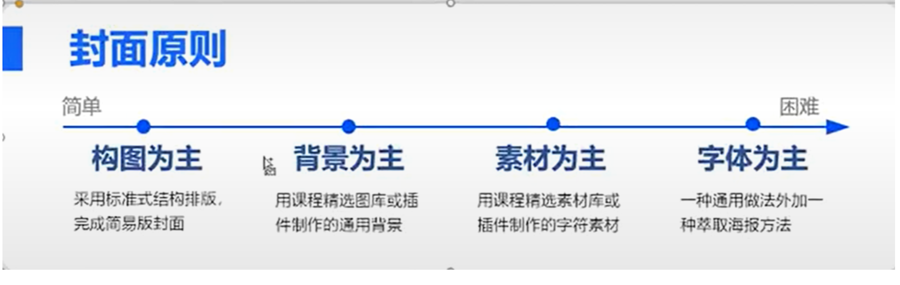
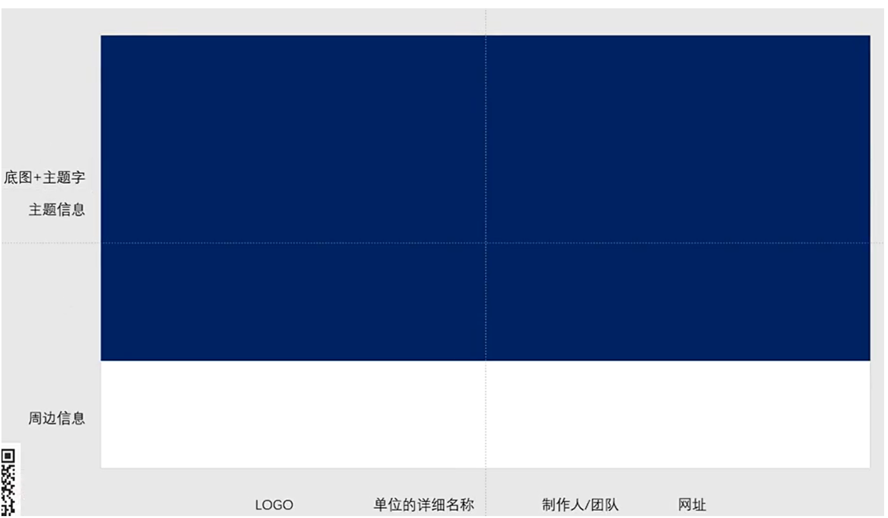
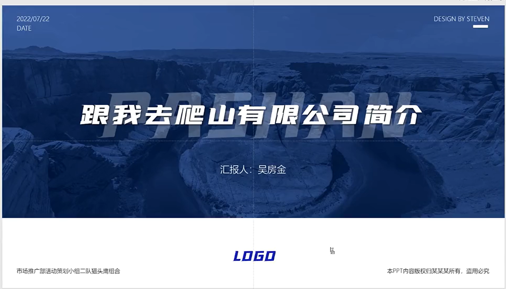
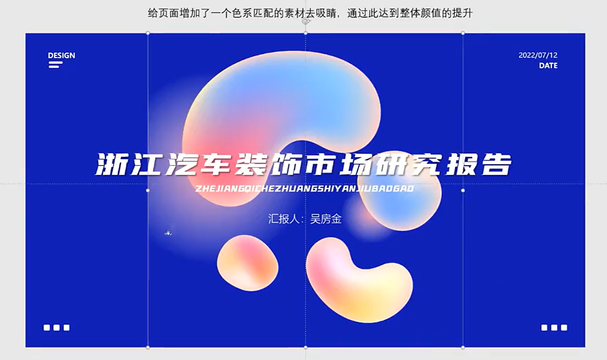
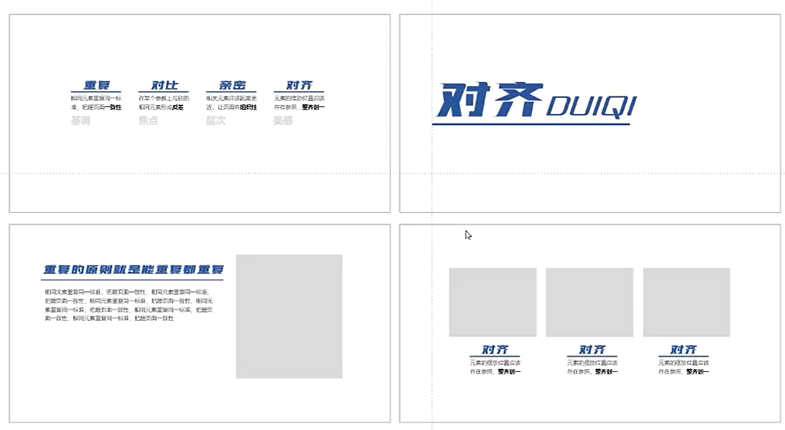
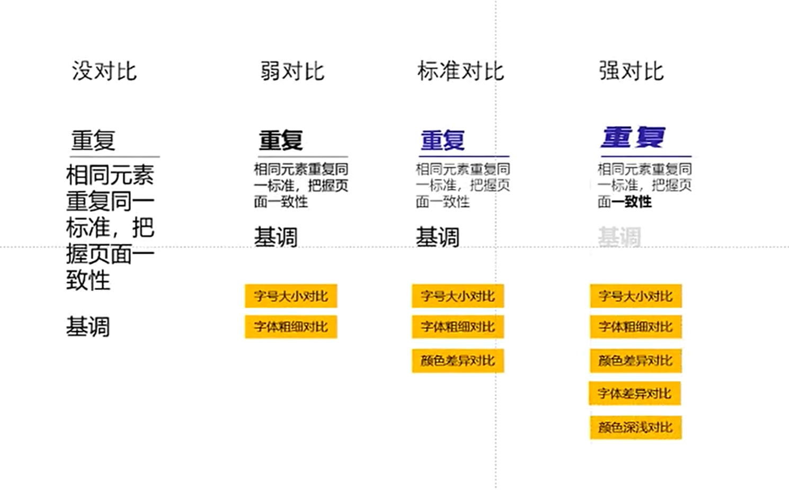
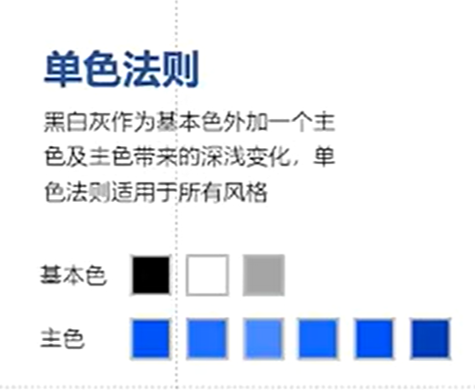
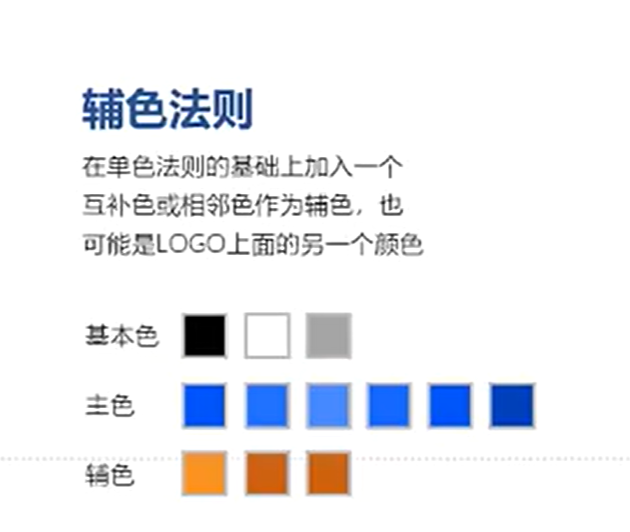
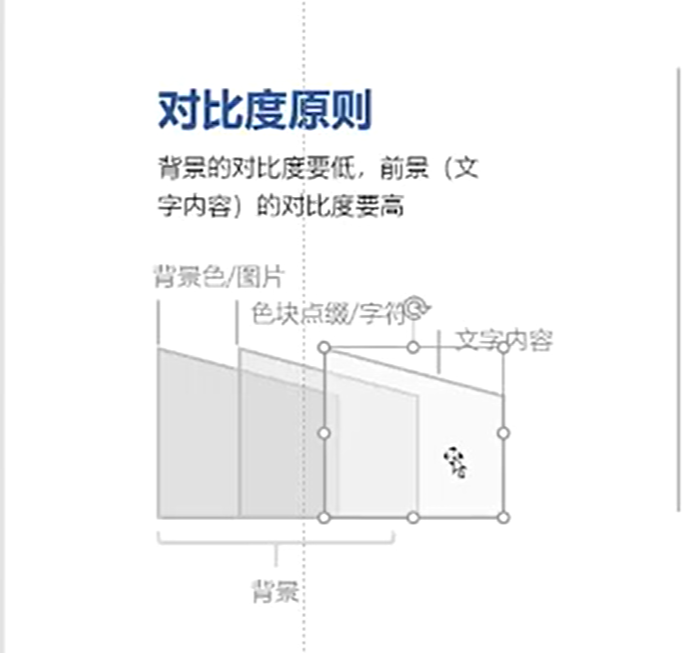
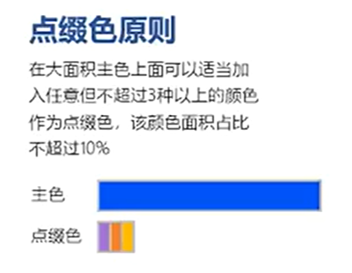

## 封面

#### 构图为主

##### 通用图

1. 风景
2. 建筑  
   ​

#### 背景为主

#### 素材为主

#### 字体为主

## 目录原则

#### 书籍式排版

#### 横排式目录

## 过度页原则

#### 全图

#### 1/2图居中

## 排版原则

#### 重复

找到重复的内容  
​

#### 对比

## 单色规则

## 辅色规则

1. 只能在色块和素材上面使用
2. 绝对不能使用在文字上  
   ​

## 对比度原则

## 点缀色原则

