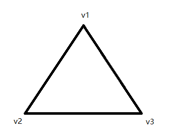
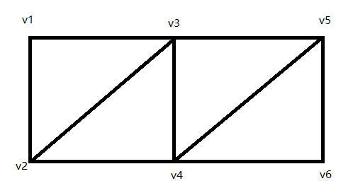
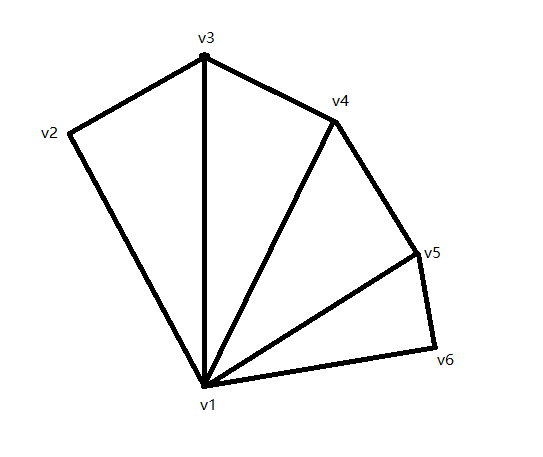

# 画三角形

# 三角形分类

- 基本三角形

  - 三角形数量=顶点数/3
  - 正常3个点的三角形【v1 v2 v3】
  - 从顶点开始，从最上方的顶点逆时针绘画  
    ​
- 三角带

  - 三角形数量=顶点-2
  - 6个顶点组成长方体，共4个三角形【v1 v2 v3】【v3 v2 v4】【v3 v4 v5】【v5 v4 v6】
  - 从顶点开始，从最上方的顶点逆时针绘画  
    ​
- 三角扇

  - 三角形数量=顶点-2
  - 6个顶点组成扇形，共4个三角形【v1 v2 v3】【v1 v3 v4】【v1 v4 v5】【v1 v5 v6】
  - 从单一顶点开始，从左往右绘画  
    ​

#   绘制第一个三角形

### index.js

```js
// 创建三角形数据，两个数据一个点
let points = [1.0, 0.5, 0.2, 0.3, 0.6, 0.8];
// 创建缓冲区 多次传入数据
const buffer = gl.createBuffer();
// 绑定缓冲区
gl.bindBuffer(gl.ARRAY_BUFFER, buffer);
// 将数据写入缓冲区 webgl浮点数占用4bit，一个字节占8bit 所以是 32bit
gl.bufferData(gl.ARRAY_BUFFER, new Float32Array(points), gl.STATIC_DRAW);
// 将缓存区数据和变量绑定
gl.enableVertexAttribArray(a_position);
// 传递数据
// 参数一：变量地址
const numComponents = 2; // 参数二：数据个数，一次取多少个数据
const type = gl.FLOAT; // 参数三：数据类型
const normalize = false; // 参数四：是否归一化（是否将数据归一化）（webgl默认归一化）
const stride = 0; // 参数五：间隔，表示数据在缓冲区中的间隔（以字节为单位）
const offset = 0; // 参数六：数据缓冲区中的偏移量（偏移量大小为缓冲区中每个数据的大小），如果是0，则表示从头开始。
gl.vertexAttribPointer(
  a_position,
  numComponents,
  type,
  normalize,
  stride,
  offset
);
initGL();
gl.drawArrays(gl.TRIANGLES, 0, 3);
function initGL() {
  // 清除画布 并设置初始颜色
  gl.clearColor(0.0, 0.0, 0.0, 1.0);
  // 用上一步
  gl.clear(gl.COLOR_BUFFER_BIT);
}

```

### index.vert

```
// 定义浮点精度
precision mediump float;
// 定义变量
// 维度 变量名
// x y轴坐标
attribute vec2 a_position;
void main() {
  gl_Position = vec4(a_position, 0.0, 1.0);
  // 顶点大小
  gl_PointSize = 10.0;
}
```

### index.frag

```
void main() {
  gl_FragColor = vec4(1.0, 0.0, 0.0, 1.0);
}
```

# 动态点击绘制三角形

### index.js

```js
import vert from "./glsl/index.vert";
import frag from "./glsl/index.frag";
import {
  createShader,
  createProgram,
  randomRGBAColor,
  canvasToWebgl,
} from "./utils/shader";
/** @type {HTMLCanvasElement} */
const canvas = document.getElementById("canvas");
window.addEventListener("resize", () => {
  resizeCanvas();
  initGlsl();
});

const gl =
  canvas.getContext("webgl") || canvas.getContext("experimental-webgl");

const vertexShader = createShader(gl, gl.VERTEX_SHADER, vert);
const fragmentShader = createShader(gl, gl.FRAGMENT_SHADER, frag);
const program = createProgram(gl, vertexShader, fragmentShader);
gl.useProgram(program);

const aPosition = gl.getAttribLocation(program, "a_position");
const uColor = gl.getUniformLocation(program, "u_color");

let points = [];
let ponit = [];
let typeCount = 3;
canvas.addEventListener("click", (e) => {
  initGlsl();
  const x = canvasToWebgl(e.clientX, canvas.width);
  const y = canvasToWebgl(e.clientY, canvas.height, -1.0);
  const color = randomRGBAColor();
  points.push({
    x,
    y,
    color,
  });
  ponit.push(x, y);
  for (let i = 0; i < points.length; i++) {
    const { x, y, color } = points[i];
    gl.vertexAttrib2f(aPosition, x, y);
    gl.uniform4f(uColor, color.r, color.g, color.b, color.a);
    gl.drawArrays(gl.POINTS, 0, 1);
  }
  if (points.length === typeCount) {
    drawTriangles(ponit);
    points = [];
    ponit = [];
  }
});

function initGlsl() {
  gl.clearColor(0.0, 0.0, 0.0, 1.0);
  gl.clear(gl.COLOR_BUFFER_BIT);
}
function resizeCanvas() {
  canvas.width = window.innerWidth;
  canvas.height = window.innerHeight;
  gl.viewport(0, 0, canvas.width, canvas.height);
}
function drawTriangles(array) {
  const buffer = gl.createBuffer();
  gl.bindBuffer(gl.ARRAY_BUFFER, buffer);
  gl.bufferData(gl.ARRAY_BUFFER, new Float32Array(array), gl.STATIC_DRAW);
  gl.enableVertexAttribArray(aPosition);
  gl.vertexAttribPointer(aPosition, 2, gl.FLOAT, false, 0, 0);
  initGlsl();
  gl.drawArrays(gl.TRIANGLES, 0, 3);
  // 禁用顶点属性,防止状态污染
  gl.disableVertexAttribArray(aPosition);
  // 删除缓冲区
  gl.deleteBuffer(buffer);
}
resizeCanvas();
initGlsl();
```

### shader.js

```js
/**
 * 创建着色器
 * @param {*} gl gl上下文
 * @param {*} type 着色器类型
 * @param {*} source 内容
 * @returns
 */
function createShader(gl, type, source) {
  const shader = gl.createShader(type);
  gl.shaderSource(shader, source);
  gl.compileShader(shader);
  return shader;
}
/**
 * 创建着色器程序
 * @param {*} gl gl上下文
 * @param {*} vertexShader 顶点着色器
 * @param {*} fragmentShader 片元着色器
 * @returns
 */
function createProgram(gl, vertexShader, fragmentShader) {
  const program = gl.createProgram();
  gl.attachShader(program, vertexShader);
  gl.attachShader(program, fragmentShader);
  gl.linkProgram(program);
  return program;
}
/** 生产随机rgba颜色 */
function randomRGBAColor() {
  return {
    r: Math.random() * 255,
    g: Math.random() * 255,
    b: Math.random() * 255,
    a: Math.random(),
  };
}
/** canvas和webgl转换
 * @param {*} nowLen 当前点击的位置
 * @param {*} canvasLen canvas的长度（x轴对于width,y轴对于height）
 * @param {number} isReverse 是否需要扭转方向 1.0 -1.0
 */
function canvasToWebgl(nowLen, canvasLen, isReverse = 1.0) {
  return (nowLen / canvasLen * 2.0 - 1.0) * isReverse;
}
export { createShader, createProgram, randomRGBAColor, canvasToWebgl };

```

### index.vert

```
precision mediump float;
attribute vec2 a_position;

void main(){
  gl_Position = vec4(a_position, 0.0, 1.0);
  gl_PointSize = 10.0;
}
```

### index.frag

```
precision mediump float;

uniform vec4 u_color;

void main(){
  vec4 color = u_color / vec4(255,255,255,1);
  gl_FragColor = color; 
}
```
