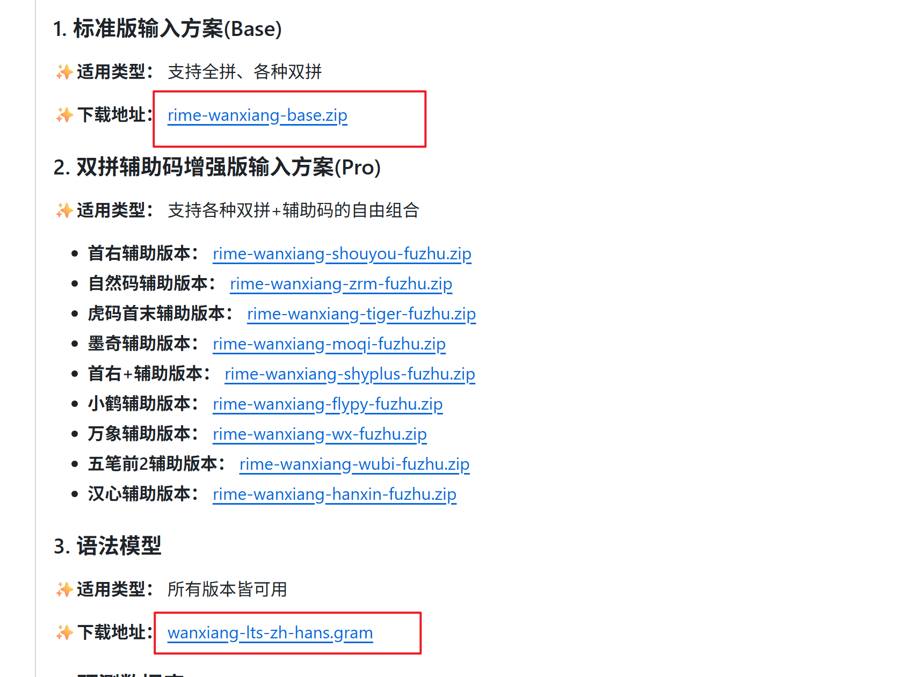
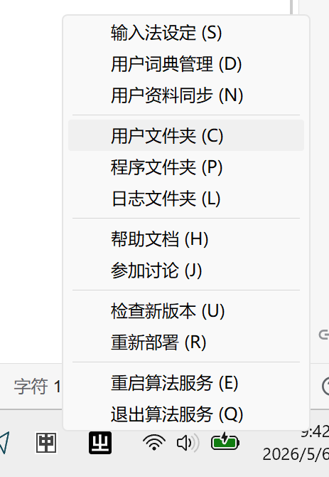

# rime+万象拼音输入法

### [RIME | 中州韻輸入法引擎](https://rime.im/)

### [Release v15.9.10 Rime万象拼音输入方案 · amzxyz/rime_wanxiang](https://github.com/amzxyz/rime_wanxiang/releases/tag/v15.9.10)

### 步骤

1. 正常安装rime
2. 下载万象输入法的文件

3. 将rime-wangxiang-base.zip解压缩、wangxiang-lts-zh-hans.gram 复制到 rime的**用户文件夹**

4. 重新部署
